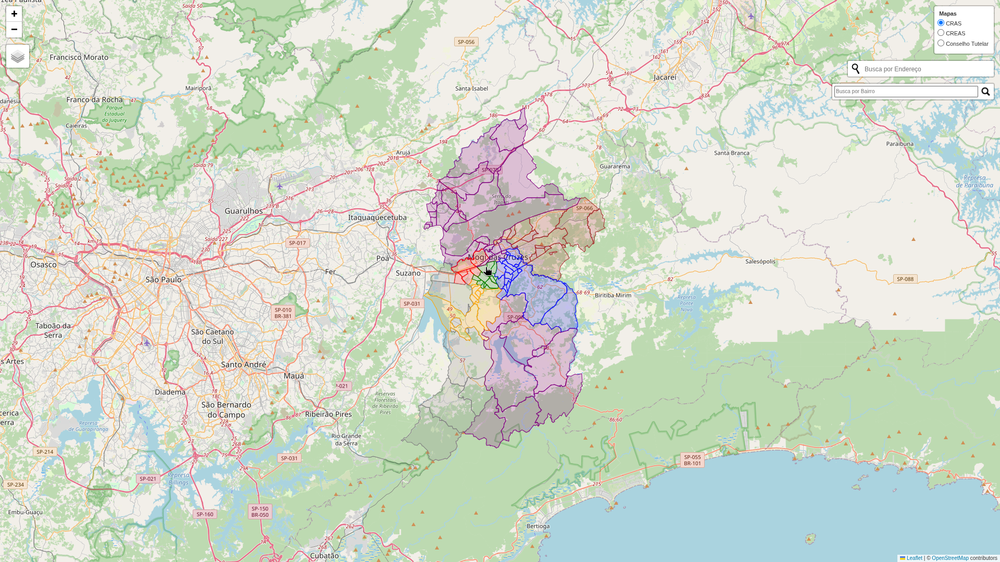

# 📖 Portal de Georreferenciamento SEMAS - Mogi
Fonte de georrefenciamento da Assistência Social de Mogi das Cruzes.

> 

  
  

> Esquerda: imagem de referência do site deste projeto dos primeiros commits.
> 
> Direita: imagem de referência de como está o VISUAS atualmente (outubro/2025).

 

## 📚 Contexto do Projeto

Durante o ano de 2025, o VISUAS (Visor de Informações para o Sistema Único de Assistência Social), site de referência para georreferenciamento de informações relacionadas a Secretaria Municipal de Assistência Social (SEMAS) de Mogi das Cruzes apresentou um problema relacionado a API de mapas utilizada no serviço e não disponibiliza mais nenhum visualização ou endereço no serviço (consultar imagem de referência neste README), limitando sua funcionalidade para a população do município.

 

O VISUAS, por sua vez, apresenta as seguintes funcionalidades:
- Mapeamento de CRAS, CREAS e Conselhos Tutelares de Mogi das Cruzes por bairro;
- Pontos no mapa referenciando os serviços ativos referentes a Secretaria de Assistência Social e suas classificações, além de serviços algumas de outras secretarias que possuem relação com a Secretaria Social.
- Pesquisa por bairros, endereços e pontos de referências presentes na cidade de Mogi das Cruzes.
- Dados por bairro referente a levantamentos realizados pela Vigilância Socioassistencial do município, sendo estes majoritariamente referentes ao cadastro único.
- Painel de informações com dashboards referentes aos dados dos levantamentos anteriormente referenciados.

> [!NOTE]
> O site do VISUAS está disponível para acesso pelo link <https://visuas.mogidascruzes.sp.gov.br/>.

 

## 🔍 O que estará presente nesse projeto?

Este projeto tem o intuito de fornecer um novo método para que essas informações sejam acessadas e incluir algumas melhorias e funcionalidades extras que não são presentes na plataforma original, entre elas:
- Layout responsivo tanto em todos os tamanhos de telas;
- Melhor disposição de alguns tipos de dados (popups sobre marcadores, inserção de imagens de referências dos serviços, etc);
- Métodos mais práticos para inserir/alterar algumas informações presentes no site (principalmente referente aos levantamentos da Vigilância Socioassistencial);
- Utilização de Bootstrap para melhorar o design do site e incluir

> [!IMPORTANT]
> Pelo escopo do projeto e outros motivos, algumas funcionalidades deste novo site apresentarão limitações (por exemplo, a busca de endereços utiliza uma API gratuita e portanto não é precisa quanto os serviços mais utilizados no cotidiano).

 

## 🎯 Coisas a fazer (To-Do List)
- [ ] Estilizar a página da web com mais componentes (navbar, sidebar, etc).
- [ ] Adicionar modal ou offcanva como forma de disponibilizar mais informações sobre cada bairro (dados de levantamentos) ao clicar neles.
- [ ] Organizar os dados dos levantamentos em uma planilha ou banco de dados de maior manutenabilidade.
- [ ] Além de muitas outras coisas...

 

## 🙇 Agredecimentos especiais
A equipe de Vigilância Socioassistencial da cidade de Mogi das Cruzes pelo apoio e suporte neste projeto.
